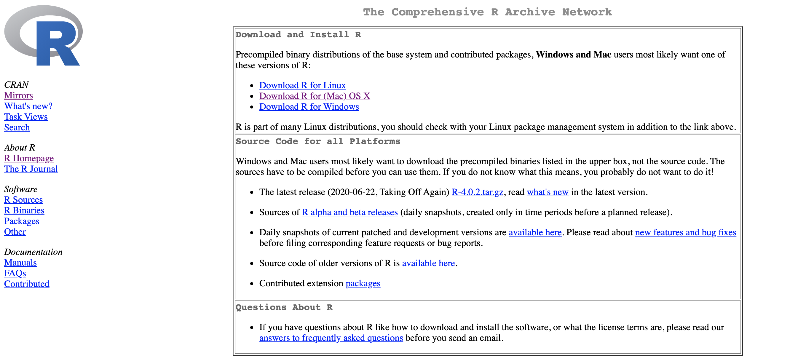
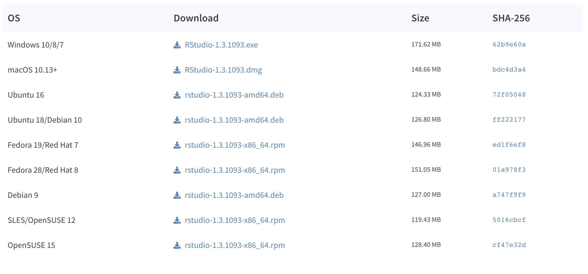
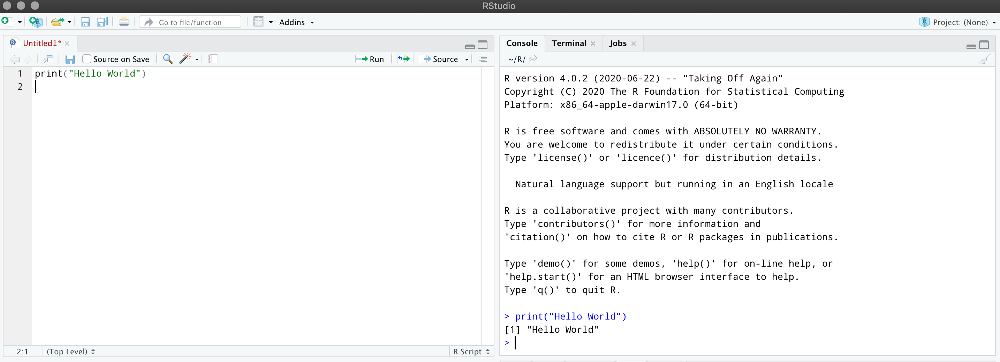
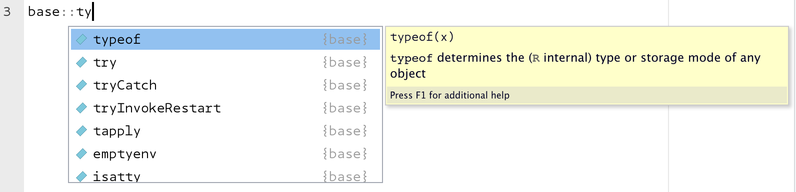
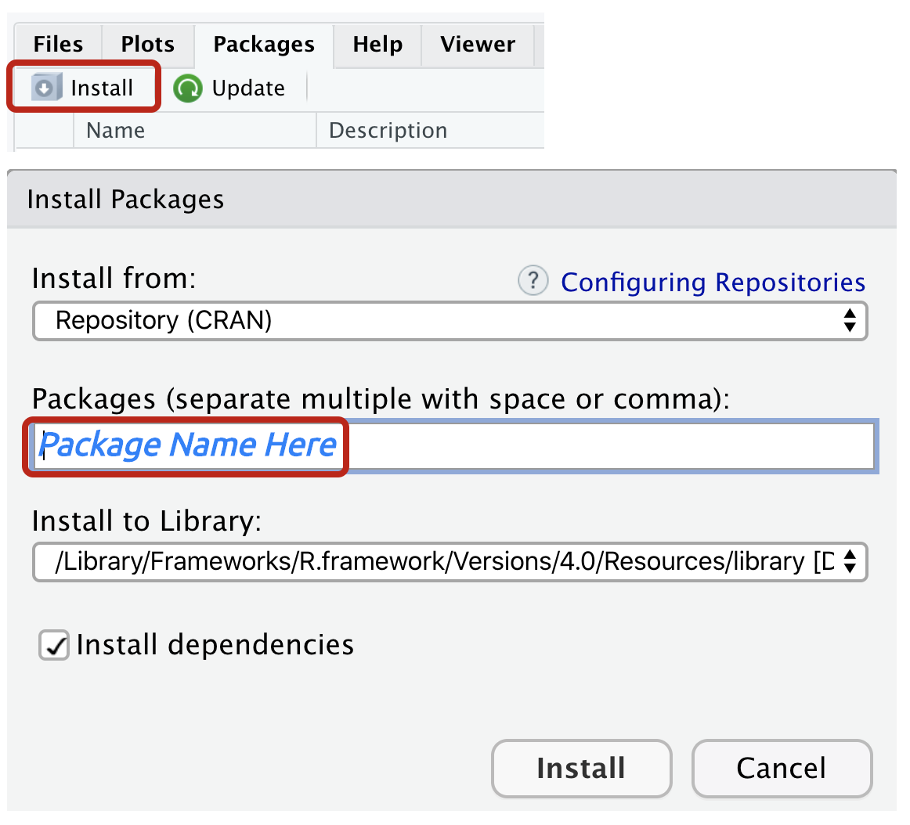

```{r setup, include=FALSE}
library(xaringanthemer)
library(xaringan)
library(pagedown)
library(tidyverse)
options(htmltools.dir.version = FALSE)
```

```{r xaringan-themer, include=FALSE, warning=FALSE}
# 
xaringanthemer::style_mono_light(base_color = "cornflowerblue")
# xaringan::inf_mr() # for instant knitting and reviewing
```

class: center, middle

# R Programming

### R is a versatile language for data wrangling, visualization, and modeling


---
background-image: url("https://www.r-project.org/logo/Rlogo.png")
background-size: contain
class: inverse, center, middle

# Getting Started


.pull-right[Image credit: [R Project](https://www.r-project.org)]

---
class: left, top

# Installing R

Install R from the Comprehensive R Archive Network (CRAN):

https://cran.r-project.org/


```{r cran, eval=TRUE, echo=FALSE}

```

--

You are recommended to use the [RStudio IDE](https://www.rstudio.com/products/rstudio/) (*but you do not have to*).


---
class: left, top

# Download RStudio

https://rstudio.com/products/rstudio/download/

```{r rstudio, eval=TRUE, echo=FALSE}

```


---
class: left, top

# Or use RStudio.Cloud

https://rstudio.cloud/


```{r rstudio-cloud, eval=TRUE, echo=FALSE}

```


---
background-image: url("img/r-console.png")
background-size: contain
class: center, bottom

# The R Console

---
background-image: url("img/rstudio-launch.png")
background-size: contain
class: left, middle

# The RStudio IDE


---
class: left, top

# Running R Commands

You can run R commands in the Console by entering them after the `>` operator (see example in R below)

.pull-left[

```{r hello-world}
print("Hello World")
```

]

--

.pull-right[


```{r commands-console, eval=TRUE, echo=FALSE, out.height="120%", out.width="120%", fig.align='center'}
knitr::include_graphics("img/commands-console.png")
```

]

---
class: left

# Running R Commands

You can also run them in R scripts (see example in RStudio below)

--

```{r script-rstudio, eval=TRUE, echo=FALSE, out.height='110%', out.width='110%', fig.align='center'}

```

---
background-image: url("https://www.r-project.org/logo/Rlogo.png")
background-size: contain
class: inverse, left, middle

# R Syntax

--

### The R syntax is comprised of two major elements:

--

.pull-left[

## Functions

#### *Functions perform operations: calculate a mean, build a table, create a graph, etc.*

]


--

.pull-right[

## Objects

#### *Objects hold information: a collection of numbers, dates, words, models results, etc.* 

]

---
class: center, middle

# We use functions to perform operations on objects

---
class: left, top

# Example: create a vector of numbers

The standard assignment operator in R is `<-`. We can use this in combination with `c()` to create an object `x`, which contains five numbers (`1`, `3`, `5`, `7`, `9`).  

```{r c-highlight, eval=FALSE}
x <- c(1, 3, 5, 7, 9) #<<
```

--

Place `x` inside `print()` to print `x` to the console  

```{r print-highlight, eval=FALSE}
x <- c(1, 3, 5, 7, 9)
print(x) #<<
```

NOTE: We can also use the `=` and move `->` to the end of the expression, but this is not recommended


---
class: left 

# R Syntax: functions

```{r create-x}
x <- c(1, 3, 5, 7, 9)
print(x)
```

In the example above, we've created object `x`, but what are `<-` and `c()`?

--

We can check this by passing them both in backticks to the `class()` function below.

--

```{r check-function-class}
class(`<-`)
```

--

```{r check-function-class-2}
class(`c`)
```

--

As we can see, these are **functions**.  

---
class: left

# Functions in R

***

.pull-left[

Objects are like nouns: they hold information

```{r nouns-objects, eval=FALSE}
object_1 <- "Sally"
object_2 <- "dog"
object_3 <- "road"
```

]

--

.pull-right[

Functions are like verbs: they do things to nouns

```{r verbs-functions, eval=FALSE}
work()
run()
implement()
```

]

--

***

#### ***Functions*** perform operations (calculate, transform, model, graph) on various ***objects*** that contain information (blood pressure measurements, monthly sales, political party affiliation, etc.)

---
class: left

# Functions and objects

Functions perform operations on objects.

--

*Sally works.*

```{r verbs-01, eval=FALSE}
object_1 <- "Sally"
work(object_1) #<<
```

--

*The dog runs.*

```{r verbs-02, eval=FALSE}
object_2 <- "dog"
run(object_2) #<<
```

--

*Implement the idea.*

```{r verbs-03, eval=FALSE}
object_3 <- "idea"
implement(object_3) #<<
```


---
class: left, top

# Packages and functions in R 

Functions are stored in R packages. Fortunately, R comes 'out-of-the-box' with a set of functions for basic data management and statistical calculations.

To access the functions in a package, use the following syntax:

```{r package-function-object, eval=FALSE}
package::function(object)
```

--

The `median()` function comes from the `stats` package.

```{r example-median}
stats::median(x)
```

--

The `typeof()` function comes from the `base` package.

```{r example-max}
base::typeof(x)
```

---
class: left

# Packages and functions

Use tab-completion and the arrow keys in RStudio to explore a packages functions. 

```{r tab-completion, echo=FALSE}

```

--

We can take advantage of tab-completion by using names that allow us to look up common objects. For example, naming plot objects with a `plot_` prefix will allow us to use tab-completion to scroll through each object without having to remember the specific name.

---
class: left

# Installing packages from CRAN

To install packages from CRAN, we can use the `install.packages()` function.

```{r install.packages, eval=FALSE}
install.packages("package name")
```

NOTE: *if this is the first time installing packages, you'll probably be presented with a list of CRAN “mirrors” to use--choose the mirror closest to you.*

--

To load the package into your environment, use `library(package name)`

```{r library, eval=FALSE}
library(package name)
```


---
class: left, top

# Installing packages from CRAN in RStudio

You can also use the **Packages** pane in RStudio

```{r install-package, echo=FALSE, fig.align='center', out.height="50%", out.width="50%"}

```


---
class: left

# Installing user packages

The code for user-written packages are typically stored in code repository, like [Github.](https://github.com/) 

--

To access all of the great user-created packages for R that haven't been uploaded to CRAN, you'll need to install the `devtools` or `remotes` packages. 

```{r devtools-remotes, eval=FALSE}
install.packages("devtools")
install.packages("remotes")
```

--

To install these packages, we can use `devtools::install_github()` or `remotes::install_github()`, and then the author's username and name of the package repository.

```{r install_github, eval=FALSE}
devtools::install_github(<username>/<package>)
remotes::install_github(<username>/<package>)
```

NOTE: you will need an internet connection to load packages 

---
background-image: url("https://www.r-project.org/logo/Rlogo.png")
background-size: contain
class: inverse, left, middle

# Objects

--

### *R is typically referred to as an "object-oriented programming" language*

--

### *We've covered functions, so now we'll dive into the aspects of some common R objects*

---
class: left, top

# Types of objects in R 

.pull-left[

- **Vectors**

 - atomic (logical, integer, double, and character)
 
 - S3 (factors, dates, date-times, durations)

- **Matrices**

 - two dimensional objects
 
 ]
 
 .pull-right[

- **Arrays**

 - multidimensional objects

- **Data frames & tibbles**  

 - rectangular objects

- **Lists** 

 - recursive objects
 
 ]

---
class: left, top

# Atomic vectors

Vectors are the fundamental data type in R. 

--

Many of R's functions are *vectorised*, which means they're designed for performing operations on vectors.

--

The "atomic" in atomic vectors means, "*of or forming a single irreducible unit or component in a larger system.*"

--

Atomic vectors can be logical, integer, double, or character (strings). 

--

We will build each of these vectors using the previously covered assignment operator (`<-`) and `c()` function (*which stands for 'combine'*).

---
class: left, top

# Store and explore

--

.pull-left[

A common practice in R is to create an object, perform an operation on that object with a function, and store the results in new object.

We then explore the contents of the new object with another function. 

]

--

.pull-right[

```{r store-explore, echo=FALSE, out.height='120%', out.width='120%', fig.align='center'}
knitr::include_graphics(path = "img/store-explore.png")
```

]

--

***

Many of the functions in R are written with this *store and explore* process in mind.

---
class: left, top

# Atomic vectors: numeric

The two atomic numeric vectors are integer and double. 

--

Integer vectors are created with a number and capital letter `L` (i.e. `1L`, `10L`)

```{r create-vec_integer}
vec_integer <- c(1L, 10L, 100L)
```

--

Double vectors can be entered as decimals, but they can also be created in scientific notation (`2.46e8`), or values determined by the floating point standard (`Inf`, `-Inf` and `NaN`).

```{r create-vec_double}
vec_double <- c(0.1, 1.0, 10.01)
```

---
class: left, top

# Atomic vectors: numeric

We will use the `typeof()` and `is.numeric()` functions to explore the contents of `vec_integer` and `vec_double`.

```{r explore-numeric-vectors}
typeof(vec_integer)
```

--

```{r is.numeric-vec_integer}
is.numeric(vec_integer)
```

--

`typeof()` tells us that this is an `"integer"` vector, and `is.numeric()` tests to see if it is numeric (which is `TRUE`).


---
class: left, top

# Atomic vectors: logical vectors

Logical vectors can be `TRUE` or `FALSE` (or `T` or `F` for short). Below we use `typeof()` and `is.logical()` to explore the contents of `vec_logical`.

--

```{r logical-vectors}
vec_logical <- c(TRUE, FALSE)
typeof(vec_logical)
```

--

```{r is.logical}
is.logical(vec_logical)
```

---
class: left, top

# Atomic vectors: logical vectors


Logical vectors are handy because we when we add them together, and the total number tells us how many `TRUE` values there are. 

```{r logical-addition}
TRUE + TRUE + FALSE + TRUE
```

--

Logical vectors can be useful for subsetting (a way of extracting certain elements from a particular object) based on a set of conditions. 

--

*How many elements in `vec_integer` are greater than `5`?*

```{r vec_integer-gt-5}
vec_integer > 5
```


---
class: left, top

# Atomic vectors: character vectors

Character vectors store text data (note the double quotes). We'll *store and explore* again.

--

```{r character-vectors}
vec_character <- c("A", "B", "C")
typeof(vec_character)
```

--

```{r is.character-vec_character}
is.character(vec_character)
```

--

Character vectors typically store text information that we need to include in a calculation, visualization, or model. In these cases, we'll need to convert them into `factor`s. We'll cover those next. 

---
class: inverse, center, middle

# S3 vectors

### *S3 vectors can be factors, dates, date-times, and difftimes.*

---
class: left, top

# S3 vectors: factors

Factors are categorical vectors with a given set of responses. Below we create a factor with three levels: `low`, `medium`, and `high`

--

```{r vec_factor}
vec_factor <- factor(x = c("low", "medium", "high"))
class(vec_factor)
```

--

Factors are not character variables, though. They get stored with an integer indicator for each character level. 

```{r typeof-vec_factor}
typeof(vec_factor)
```

---
class: left, top

# S3 vectors: factor attributes

Factors are integer vectors with two additional attributes: `class` is set to `factor`, and `levels` for each unique response.

--

We can check this with `unique()` and `attributes()` functions. 

```{r unique-vec_factor, highlight.output = 2}
unique(vec_factor)
```

--

```{r attributes-vec_factor, highlight.output = 1}
attributes(vec_factor)
```

---
class: left, top

# S3 vectors: factor attributes 

Levels are assigned alphabetically, but we can manually assign the order of factor levels with the `levels` argument in `factor()`.

--

```{r levels}
vec_factor <- factor(x = c("medium", "high", "low"), 
                     levels = c("low", "medium", "high"))
```

--

We can check the levels with `levels()` or `unclass()`

```{r levels-vec_factor}
levels(vec_factor)
```

--

```{r unclass-vec_factor, highlight.output = c(1, 3)}
unclass(vec_factor)
```


---
class: left, top

# S3 vectors: date

Dates are stored as `double` vectors with a `class` attribute set to `Date`.  

--

R has a function for getting today's date, `Sys.Date()`. We'll create a `vec_date` using `Sys.Date()` and adding `1` and `2` to this value. 

```{r vec_date}
vec_date <- c(Sys.Date(), Sys.Date() + 1, Sys.Date() + 2)
vec_date
```

--

We can see adding units to the `Sys.Date()` added days to today's date. 

--

The `attributes()` function tells us this vector has it's own class. 

```{r attributes-vec_date}
attributes(vec_date)
```

---
class: left, top

# S3 vectors: date calculations

Dates are stored as a number because they represent the amount of days since January 1, 1970, which is referred to as the [UNIX Epoch](https://en.wikipedia.org/wiki/Unix_time).

--

`unclass()` tells us what the actual number is.

```{r unclass-vec_date}
unclass(vec_date)
```


---
class: left, top

# S3 vectors: date-time

Date-times contain a bit more information than dates. The function to create a datetime vector is `as.POSIXct()`. 

We'll convert `vec_date` to a date-time and store it in `vec_datetime_ct`. View the results below.

--

```{r view-vec_date}
vec_date
```

--

```{r vec_datetime_ct}
vec_datetime_ct <- as.POSIXct(x = vec_date)
vec_datetime_ct
```

We can see `vec_datetime_ct` stores some additional information. 

---
class: left, top

# S3 vectors: date-time attributes

`vec_datetime_ct` is a `double` vector with an additional attribute of `class` set to `"POSIXct" "POSIXt"`.

```{r typeof-vec_datetime_ct}
typeof(vec_datetime_ct)
```

--

```{r attributes-vec_datetime_ct}
attributes(vec_datetime_ct)
```

---
class: left, top

# S3 vectors: date-time help

.pull-left[

Read more about date-times by entering the `as.POSIXct` function into the console preceded by a question mark. 

```{r help-as.POSIXct-console, eval=FALSE}
?as.POSIXct
```

]

--

.pull-right[

```{r help-date-time, echo=FALSE, out.height="120%", out.width="120%", fig.align='center'}
knitr::include_graphics(path = "img/help-date-time.png")
```

]

---
class: left, top

# S3 vectors: difftime

Difftimes are durations, so we need to supply two dates, which we will create with `time_01` and `time_02`.

```{r vec_difftime}
time_01 <- Sys.Date()
time_02 <- Sys.Date() + 10
vec_difftime <- difftime(time_01, time_02, units = "days")
vec_difftime
```

--

Difftimes are stored as a `double` vector. 

```{r typeof-vec_difftime}
typeof(vec_difftime)
```

---
class: left, top

# S3 vectors: difftime attributes

Difftimes are their own `class` and have a `units` attribute set to whatever we've specified in the `units` argument.


```{r attributes-vec_difftime, highlight.output=4}
attributes(vec_difftime)
```

--

We can see the actual number stored in the vector with `unclass()`

```{r unclass-vec_difftime, highlight.output=2}
unclass(vec_difftime)
```


---
class: left, top

# Matrices 

A matrix is several vectors stored together into two a two-dimensional object. 

```{r mat_data}
mat_data <- matrix(data = c(vec_double, vec_integer), 
                   nrow = 3, ncol = 2, byrow = FALSE)
mat_data
```

This is a three-column, two-row matrix. 

We can check the dimensions of `mat_data` with `dim()`.

```{r dim-mat_data}
dim(mat_data)
```


---
class: left, top

# Matrix positions

The output in the console tells us where each element is located in `mat_data`. 

For example, if I want to get the `10` that's stored in `vec_integer`, I can use look at the output and use the indexes. 

--

.pull-left[

```{r mat_data-subset, highlight.output=c(1,3)}
mat_data
```

]

--

.pull-right[


```{r subset-10}
mat_data[2, 2]
```
]

--

By placing the index (`[2, 2]`) next to the object, I am telling R, "*only return the value in this position*".


---
class: left, top

# Arrays

Arrays are like matrices, but they can have more dimensions. 

```{r dat_array}
dat_array <- array(data = c(1, 2, 3, 4, 5, 6, 7, 8, 9, 10, 11, 12, 13,
                            14, 15, 16, 17, 18), dim = c(3, 3, 2))
```

--


```{r print-dat_array}
dat_array
```


---
class: left, top

# Array layers

`dat_array` contains numbers 1 through 18 in three columns and three rows, stacked in two *layers*. 

Matrices are arrays, but arrays are not matrices. 

--

.pull-left[ 

```{r array-png, out.height='75%', out.width='75%', fig.align='center', echo=FALSE}
knitr::include_graphics(path = "img/array.png")
```

]

--

.pull-right[ 

```{r class-array-matrix}
class(dat_array)
class(mat_data)
```

]

---
class: left, top

# Data Frames

Data frames are rectangular data with rows and columns (or observations and variables).

```{r DataFrame, highlight.output = 1}
DataFrame <- data.frame(character = c("A", "B", "C"), 
                       integer = c(0.1, 1.0, 10.01), 
                       logical = c(TRUE, FALSE, TRUE), 
                        stringsAsFactors = FALSE)
DataFrame
```

NOTE: `stringsAsFactors = FALSE` is not required as of R version 4.0.0.

---
class: left

# Data Frames

Check the structure of the `data.frame` with `str()`

```{r str-DataFrame, highlight.output = 1}
str(DataFrame)
```

`str()` gives us a transposed view of the `DataFrame` object, and tells us the dimensions of the object.

---
class: left

# Tibbles 

Tibbles are a special kind of `data.frame` (they print better to the console and character vectors are never coerced into factors). 

The syntax to build them is slightly different, too.

```{r Tibble}
Tibble <- tibble::tribble(
       ~character, ~integer,  ~logical, #<<
              "A",      0.1,      TRUE,
              "B",        1,     FALSE,
              "C",    10.01,      TRUE)
Tibble
```


---
class: left

# Tibbles 

Check the structure of `Tibble`.

```{r str-tibble, highlight.output=1}
str(Tibble)
```

--

`str()` tells us `tibbles` are `S3` objects, with types  `tbl_df`, `tbl`, and `data.frame`.

---
class: left, top

# Data frames and tibbles 

If you're importing spreadsheets, most of the work you'll do in R will be with rectangular data objects (i.e. `data.frame`s and `tibble`s).

--

.pull-left[

```{r data-frame-tibble, echo=FALSE, out.width='80%', out.height='80%', fig.align='center'}
knitr::include_graphics(path = "img/data-frame-tibble.png")
```

]

--

.pull-right[

*These are the common rectangular data storage object for tabular data in R*

]

---
class: left

# Data frames & tibbles 

.pull-left[

```{r compare-DataFrame}
DataFrame
```

]

.pull-right[

```{r compare-Tibble}
Tibble
```

]

--

If we check the `type` of the `DataFrame` and `Tibble`...

--

```{r typeof-DataFrame-Tibble}
typeof(DataFrame)
typeof(Tibble)
```

...we see they are `lists`


---
class: left

# Data Frames & Tibbles 

Both `data.frame`s and `tibble`s are their own class, 

```{r class-DataFrame-Tibble}
class(DataFrame)
class(Tibble)
```

So we can think of `data.frame`s and `tibble`s as special kinds of *rectangular* lists, made with different types of vectors, with each vector being of equal length.

---
class: left

# Lists 

Lists are special objects because they can contain all other objects (including other lists).

```{r dat_list}
dat_list <- list("integer" = vec_integer, 
                 "array" = dat_array,
                 "matrix data" = mat_data,
                 "data frame" = DataFrame, 
                 "tibble" = Tibble)
```

Lists have a `names` attribute, which we've defined above in double quotes.

```{r attributes-list, highlight.output=1}
attributes(dat_list)
```

---
class: left

# List structure

If we check the structure of the `dat_list`, we see the structure of list, and the structure of the elements in the list.

```{r str-dat_list, highlight.output=c(2,3,4,5,9)}
str(dat_list)
```

---
class: left, top

# Recap

**In R, two major elements: functions and objects.** 

 - *functions are verbs, objects are nouns*
 
--

**Packages: use `install.packages()` and `library()` to load functions from packages**  

 - *or `devtools::install_github(<username>/<package>)` or `remotes::install_github(<username>/<package>)`*

--

**The most common R object is a vector**

 - Atomic vectors: *logical, integer, double, or character (strings)*  
 - S3 vectors: *factors, dates, date-times, and difftimes*  
 
---
class: left, top

# Recap, cont.

**More complicated data structures: matrices and arrays**  

  - Matrix: *two-dimensional object*   
  - Array: *multidimensional object*  

--

**Rectangular data structures:**

  - *`data.frame`s & `tibble`s are special kinds of rectangular lists, which can hold different types of vectors, with each vector being of equal length* 
--


**Catch-all data structures:**

  - *lists can contain all other objects (including other lists)*

---
class: left, top

# More resources

Learn more about R objects in the help files or the following online texts: 

1. [R for Data Science](https://r4ds.had.co.nz/) 

2. [Advanced R](https://adv-r.hadley.nz/)  

3. [Hands on Programming with R](https://rstudio-education.github.io/hopr/r-objects.html)

4. [R Language Definition](https://cran.r-project.org/doc/manuals/r-release/R-lang.html#Objects)

---
class: center, top

# THANK YOU!

## Feedback

@mjfrigaard on Twitter and Github

mjfrigaard@gmail.com 


```{r chrome_print, echo=FALSE, results='hide'}
pagedown::chrome_print("01-intro-to-r-programming.html")
```

