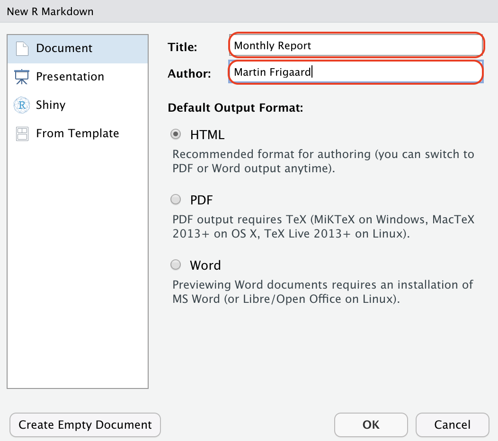
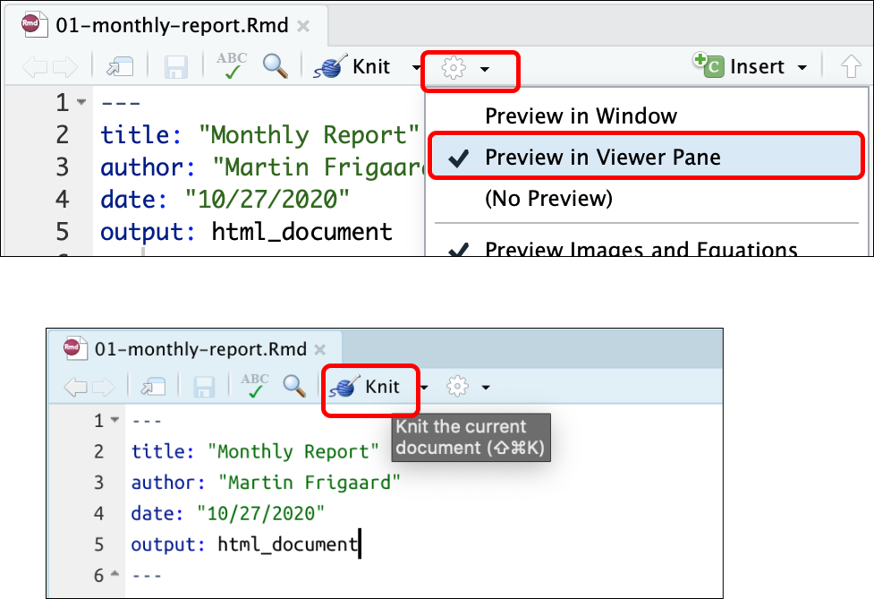
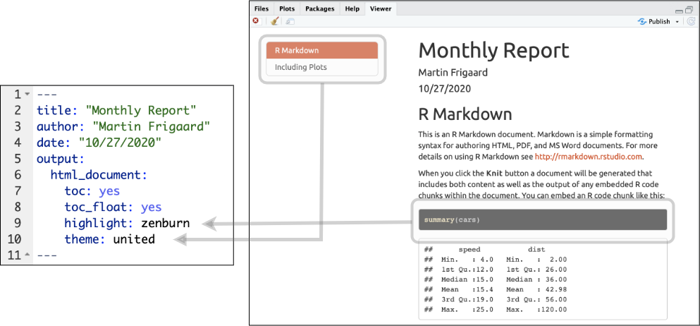

```{r setup, include=FALSE}
options(htmltools.dir.version = FALSE, tibble.max_extra_cols = 6, 
        tibble.width = 60)
knitr::opts_chunk$set(warning = FALSE, message = FALSE, fig.align = "center", 
                      dpi = 320)
library(tidyverse)
library(gapminder)
library(here)
```

```{r xaringan-themer, include=FALSE, warning=FALSE}
library(xaringanthemer)
xaringanthemer::style_mono_light(base_color = "cornflowerblue")
```

```{r xaringan-inf_mr, echo=FALSE, eval=FALSE, include=FALSE}
# xaringan::inf_mr() # for instant knitting and reviewing
```


```{r rmarkdown_wizards, echo=FALSE, out.width="100%", out.height="100%"}
knitr::include_graphics("img/rmarkdown_wizards.png")
```

.pull-right[Artwork by @allison_horst]

---
background-image: url(img/rmarkdown.png)
background-position: 93% 10%
background-size: 10%

# Getting set up 

## Make sure you've created a Github account

If you haven't, Head over to Github and create a free account. 

.pull-left[

```{r create-github-account, echo=FALSE, out.width="150%", out.height="150%"}
knitr::include_graphics("img/create-github-account.png")
```

]

--

.pull-right[

#### *Follow this link:* 

https://github.com/join

]

---
background-image: url(img/rmarkdown.png)
background-position: 93% 10%
background-size: 10%

# Getting RStudio Set Up 

<br><br>

### Head over to RStudio.Cloud and sign in with your Github account

.pull-left[

```{r welcome-rstudio-cloud, echo=FALSE, out.width="170%", out.height="170%"}
knitr::include_graphics("img/welcome-rstudio-cloud.png")
```

]

.pull-right[

```{r login-with-github, echo=FALSE, out.width="60%", out.height="60%"}
knitr::include_graphics("img/login-with-github.png")
```

]

---
background-image: url(img/rmarkdown.png)
background-position: 93% 10%
background-size: 10%

# RStudio.Cloud Workspace

### *This is where your new projects will show up!*

```{r new-rstudio-cloud-env, echo=FALSE, out.width="170%", out.height="170%"}
knitr::include_graphics(path = "img/new-rstudio-cloud-env.png")
```


---
background-image: url(img/rmarkdown.png)
background-position: 93% 10%
background-size: 10%

# Click on the link below:

https://rstudio.cloud/project/1859537

### Click *Save a Permanent Copy* and create a personal copy in your workspace

```{r save-rstudio-cloud-copy, echo=FALSE, out.width="80%", out.height="80%"}
knitr::include_graphics(path = "img/save-rstudio-cloud-copy.png")
```


---
background-image: url(img/rmarkdown.png)
background-position: 93% 10%
background-size: 10%

# What you should see

<br>

### Now you have a local copy of this RStudio project in your RStudio.Cloud workspace. 

```{r open-rstudio-cloud-project, echo=FALSE, out.width="95%", out.height="95%"}
knitr::include_graphics(path = "img/open-rstudio-cloud-project.png")
```

---
class: inverse, center
background-image: url(img/rmarkdown.png)
background-position: 50% 22%
background-size: 12%

# *What is RMarkdown?*

<br><br><br>

--

### 1) Data analysis/writing workflow: *code and text in same document*

--

### 2) End-to-end reproducibility: *re-run your analysis and produce the same result*

--

### 3) Flexible outputs: *create a variety of outputs (.pdf, .docx, .pptx, .html)*

---
class: center, top

# `rmarkdown` works directly with `knitr`

<br>


.pull-left[

`rmarkdown` combines R code and markdown into a variety of formats


```{r rmarkdown, echo=FALSE, out.width="40%", out.height="40%"}
knitr::include_graphics("img/rmarkdown.png")
```

]

--

.pull-right[

`knitr` supports literate programming and generates dynamic documents 

```{r knitr, echo=FALSE, out.width="40%", out.height="40%"}
knitr::include_graphics("img/knitr.png")
```

]

---
background-image: url(img/rmarkdown.png)
background-position: 95% 8%
background-size: 12%
class: inverse, middle, center

# A quick example...

### We will create an example HTML report using the R Markdown template provided by RStudio

---
background-image: url(img/rmarkdown.png)
background-position: 95% 12%
background-size: 9%
class: left, top

# Your turn: create a new RMarkdown file


.pull-left[

### *File* >>> 

### *New File* >>> 

### *R Markdown... >>> * 

]


.pull-right[

### *Or use the drop-down menu*

```{r new-rmarkdown, echo = FALSE, out.height="35%", out.width="35%"}
knitr::include_graphics("img/new-rmarkdown.png")
```

]

---
background-image: url(img/rmarkdown.png)
background-position: 7% 93%
background-size: 8%
class: left, top

# Install required packages 

<br>

.pull-left[

RStudio will ask to install the required packages for R Markdown, Click *Yes*

```{r install-req-packages, echo = FALSE, out.height="100%", out.width="100%"}
knitr::include_graphics("img/install-req-packages.png")
```

]

--

.pull-right[

You will see RStudio install the packages in the **Jobs** pane

```{r rmd-pckgs-jobs, echo = FALSE, out.height="180%", out.width="180%"}

```

]


---
background-image: url(img/rmarkdown.png)
background-position: 7% 93%
background-size: 8%
class: middle

# Your new `.Rmd` file

### Enter ***Title*** and ***Author*** of your report and click ***OK***

```{r rmarkdown-defaults, echo = FALSE, out.height="60%", out.width="60%"}

```


---
background-image: url(img/rmarkdown.png)
background-position: 7% 93%
background-size: 8%
class: left, top

# Save your `.Rmd` file

### Click on the small floppy disk to save your `.Rmd` file

### Enter a name (`01-monthly-report.Rmd`) 

```{r save-rmd-file, echo = FALSE, out.height="60%", out.width="60%"}
knitr::include_graphics("img/save-rmd-file.png")
```

---
background-image: url(img/rmarkdown.png)
background-position: 7% 93%
background-size: 8%
class: left, top

# Knit your .Rmd file

### Click on the small gear, select *Preview in Viewer Pane*

### Click on the knit icon (ball of yarn)

```{r knit-rmd-file, echo = FALSE, out.height="60%", out.width="60%"}

```

---
background-image: url(img/rmarkdown.png)
background-position: 93% 7%
background-size: 8%
class: left, center

## R Markdown in action!

```{r rmarkdown-in-action, echo = FALSE, out.height="110%", out.width="110%"}

```

---
background-image: url(img/rmarkdown.png)
background-position: 95% 8%
background-size: 8%
class: inverse, middle, center

# How R Markdown Works

---
background-image: url(img/how-rmd-works.png)
background-position: 50% 50%
background-size: 96%
class: left, middle

---
background-image: url(img/rmarkdown.png)
background-position: 8% 95%
background-size: 8%
class: center, middle

# Rmarkdown combines metadata, R Code *and* markdown

```{r r-plus-md, echo = FALSE, out.height="70%", out.width="70%"}
knitr::include_graphics("img/r-plus-md.png")
```

### .yaml = Metadata 
### .md = Prose   
### .R = Code    

---
background-image: url(img/rmarkdown.png)
background-position: 93% 10%
background-size: 8%

# R Markdown

## `.yaml` = Metadata
### ~~`.md` = Prose~~  
### ~~`.R` = Code~~

<br><br>

### YAML stands for *YAML Ain't Markup Language* (funny, huh?)


---
background-image: url(img/rmarkdown.png)
background-position: 93% 10%
background-size: 8%

# R Markdown: YAML

<br><br>

### YAML contains the information about what kind of output we're going to create

```yaml
---
title: "Monthly Report"
author: "Martin Frigaard"
date: "10/27/2020"
output: html_document
---
```

---
background-image: url(img/rmarkdown.png)
background-position: 7% 96%
background-size: 8%

# YAML output options: table of contents 

### `toc:` can be set to `true` or `false`

### `toc_float:` can be set to `true` or `false`

### `toc_depth:` set numerically `0` - `6`

---
background-image: url(img/rmarkdown.png)
background-position: 93% 10%
background-size: 8%

# R Markdown: YAML settings

<br><br>

### Change `output` in the YAML header to the following: 

```yaml
output: 
  html_document: 
    toc: yes
    toc_float: true
```

### Knit the document again

---
background-image: url(img/rmarkdown.png)
background-position: 7% 96%
background-size: 8%

# YAML output options: table of contents 

### Floating table of contents (rendered)

```{r yaml-toc-settings, echo = FALSE, out.height="100%", out.width="100%"}
knitr::include_graphics("img/yaml-toc-settings.png")
```

---
background-image: url(img/rmarkdown.png)
background-position: 97% 10%
background-size: 8%

# YAML output options: text highlighting and table options

### Add the following two options to your YAML header

```yaml

output: 
  html_document: 
    toc: yes
    toc_float: yes
    highlight: zenburn
    theme: united
---

```

### Knit the document again

---
background-image: url(img/rmarkdown.png)
background-position: 7% 96%
background-size: 8%

# YAML output options: table of contents 

### Floating table of contents (rendered)

```{r yaml-highlight-theme, echo = FALSE, out.height="100%", out.width="100%"}

```

---
background-image: url(img/rmarkdown.png)
background-position: 7% 96%
background-size: 8%

# YAML Parameters

### YAML parameters can be referred to throughout the document

```yaml
---
params: 
  param1: x
  param2: y
  data: df
---
```

--

```{r, eval = FALSE}
params$param1
params$param2
params$data
```

---

### Your turn 8

###  Change the `params` option in the YAML header to use a different continent. Re-knit

```{r, eval = FALSE}
gapminder %>% 
  filter(continent == params$continent) %>% 
  ggplot(aes(x = year, y = lifeExp, group = country, color = country)) +
  geom_line(lwd = 1, show.legend = FALSE) + 
  scale_color_manual(values = country_colors) +
  theme_minimal(14) + 
  theme(strip.text = element_text(size = rel(1.1))) +
  ggtitle(paste("Continent:", params$continent))
```

---
background-image: url(img/rmarkdown.png)
background-position: 93% 10%
background-size: 10%

# YAML output formats

Function       | Outputs
-------------- | --------------------------
`html_document()`   | HTML
`pdf_document()`  | PDF
`word_document()` | Word .docx
`odt_document()`   | .odt
`rtf_document()`   | .rtf
`md_document()`   | Markdown
`slidy_presentation()`   | Slidy Slides (HTML)
`beamer_presentation()`   | Beamer Slides (PDF)
`ioslides_presentation()`   | ioslides (HTML)
`powerpoint_presentation()`   | Powerpoint Slides

---
background-image: url(img/rmarkdown.png)
background-position: 93% 10%
background-size: 15%


# R Markdown

## **Prose** = *Markdown*
## ~~Code~~
## ~~Metadata~~

```{r, echo = FALSE, out.height="100%", out.width="100%"}
# knitr::include_graphics("img/yaml_example.png")
```

```{r, echo = FALSE, out.height="100%", out.width="100%"}
# knitr::include_graphics("img/yaml_example_noted.png")
```

```{r, echo = FALSE, out.height="100%", out.width="100%"}
# knitr::include_graphics("img/yaml_example_noted2.png")
```

```{r, echo = FALSE, out.height="100%", out.width="100%"}
# knitr::include_graphics("img/yaml_example_noted3.png")
```

```{r, echo = FALSE, out.height="100%", out.width="100%"}
# knitr::include_graphics("img/yaml_example_noted4.png")
```
  

---
background-image: url(img/rmarkdown.png)
background-position: 93% 10%
background-size: 15%


# R Markdown

## **Prose** = *Markdown*
## ~~Code~~
## ~~Metadata~~

---
background-image: url(img/markdown.png)
background-position: 93% 10%
background-size: 15%
class: left, top

# Basic Markdown Syntax

<br><br><br><br>

.pull-left[

```md
 *italic*   **bold**

 _italic_   __bold__
```

]

--

.pull-right[

 *italic*   **bold**

 _italic_   __bold__

]

---
background-image: url(img/markdown.png)
background-position: 93% 10%
background-size: 15%
class: left, top

# Basic Markdown Syntax

<br><br><br>

.pull-left[

```md
# Header 1

## Header 2

### Header 3
```

]

--

.pull-right[

# Header 1
## Header 2
### Header 3

]

---
background-image: url(img/markdown.png)
background-position: 93% 10%
background-size: 15%
class: left, top

# Basic Markdown Syntax

<br><br><br>

.pull-left[

```md
 * Item 1
 * Item 2
    + Item 2a
    + Item 2b
    
 1. Item 1
 2. Item 2
```

]

--

.pull-right[

* Item 1  
* Item 2
    + Item 2a
    + Item 2b


 1. Item 1
 2. Item 2

]


---
background-image: url(img/markdown.png)
background-position: 93% 10%
background-size: 15%
class: left, top

# Basic Markdown Syntax

<br><br><br>

```md
https://www.biomarin.com/

[linked phrase](https://www.biomarin.com/)
```

### *becomes...*

--

[linked phrase](https://www.biomarin.com/)


---
background-image: url(img/markdown.png)
background-position: 93% 10%
background-size: 15%
class: left, top


# Basic Markdown Syntax

<br><br><br>

```md


```

### *becomes...*

--

```{r Rlogo.png, echo = FALSE, out.height="30%", out.width="30%"}
knitr::include_graphics("https://www.r-project.org/logo/Rlogo.png")
```


---
background-image: url(img/markdown.png)
background-position: 93% 10%
background-size: 15%
class: left, top

# Basic Markdown Syntax

<br><br><br><br><br><br>

.pull-left[

```md
$equation$

$$ equation $$
```

]

--

.pull-right[

$equation$

$$ equation $$

]


---
background-image: url(img/markdown.png)
background-position: 93% 10%
background-size: 15%
class: left, top

# Basic Markdown Syntax

<br><br><br><br><br><br>

.pull-left[

```md
~~strikethrough~~
```
]

--

.pull-right[

~~strikethrough~~

]

---
background-image: url(img/rmarkdown.png)
background-position: 93% 10%
background-size: 12%

# R Markdown

## ~~Prose~~
## **Code** = *R code chunks*
## ~~Metadata~~

---

# Code chunks

```{r, echo = FALSE, out.height="100%", out.width="100%"}
knitr::include_graphics("img/code_chunk.png")
```

---

### Code chunks

```{r, echo = FALSE, out.height="100%", out.width="100%"}
  knitr::include_graphics("img/code_chunk_fences.png")
```

---

### Code chunks

```{r, echo = FALSE, out.height="100%", out.width="100%"}
  knitr::include_graphics("img/code_chunk_opts.png")
```

---

## Chunk options

Option       | Effect
-------------- | --------------------------
`include = FALSE`   | run the code but don't print it or results
`eval = FALSE`   | don't evaluate the code
`echo = FALSE`  | run the code and output but don't print code
`message = FALSE` | don't print messages (e.g. from a function)
`warning = FALSE`   | don't print warnings
`fig.cap = "Figure 1`   | caption output plot with "Figure 1"

--

## See the [knitr web page](https://yihui.name/knitr/options/)

---

## Engines

## 52! Including **Python**, **Julia**, **C++**, **SQL**, **SAS**, and **Stata**

---

## Insert code chunks with **`cmd/ctrl + alt/option + I`**


```{r, echo = FALSE, out.height="30%", out.width="30%"}
knitr::include_graphics("img/rmarkdown_knit.png")
```

---

## Edit code chunk options

```{r, echo = FALSE, out.height="100%", out.width="100%"}
knitr::include_graphics("img/chunk_setup_gui.png")
```

---

## Your turn 4 (open **`exercises.Rmd`**)

### Create a code chunk. You can type it in manually, use the keyboard short-cut (Cmd/Ctrl + Option/Alt + I), or use the "Insert" button above. Put the following code in it:

```r
gapminder %>% 
  slice(1:5) %>% 
  knitr::kable()
```
### Knit the document

---

## Your turn 5
  
### Add `echo = FALSE` to the code chunk above and re-knit

### Remove `echo = FALSE` from the code chunk and move it to `knitr::opts_chunk$set()` in the `setup` code chunk. Re-knit. What's different about this?


--

### **Make sure to remove `knitr::opts_chunk$set(echo = FALSE)`**

---

### Inline Code

```{r, echo = FALSE, out.height="75%", out.width="75%"}
knitr::include_graphics("img/inline_code.png")
```

---

### Inline Code

```{r, echo = FALSE, out.height="75%", out.width="75%"}
knitr::include_graphics("img/inline_code_highlight.png")
```

---

### Your turn 6

### Remove `eval = FALSE` so that R Markdown evaluates the code

### Use `summarize()` and `n_distinct()` to get the the number of unique years in gapminder and save the results as `n_years`

### Use inline code to describe the data set in the text below the code chunk and re-knit.

---

# Make cool stuff in R Markdown!

## bookdown
## blogdown
## these slides!

---
class: left, top

# Resources

### [R Markdown](https://bookdown.org/yihui/rmarkdown/): A comprehensive but friendly introduction to R Markdown and friends. Free online.

### Check out the `citr` package for easy citation insertion and .bib management

### [R for Data Science](http://r4ds.had.co.nz/): A comprehensive but friendly introduction to the tidyverse. Free online.

### [R Markdown for Scientists](https://rmd4sci.njtierney.com/): R Markdown for Scientists workshop material

### Do the ten-twenty minute tutorial on markdown at https://commonmark.org/help/tutorial. 

### check out the [`ymlthis` package](https://r-lib.github.io/ymlthis/) for tools and documentation for working with YAML

```{r chrome_print, echo=FALSE, results='hide'}
# pagedown::chrome_print("04-rmarkdown-intro.html")
```